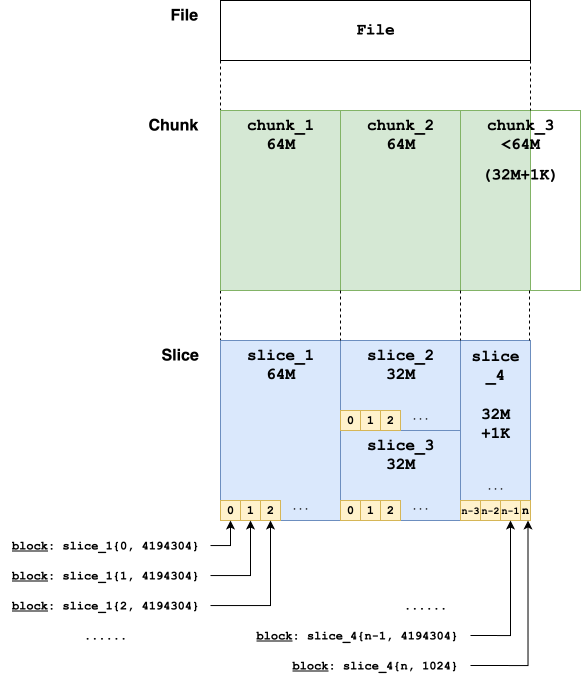

TL; DR: `juicefs dump` 在使用 SQL 类存储作为元数据引擎时，多线程无法保证一致性，设计上不应为警告而应直接终止，导出元数据不一致的情况下完全无法用于恢复；特别地，即使解决了导出备份的一致性问题，如果在备份时间点后有较多的文件修改操作，亦将耗费极长的的时间用于完整性检查。任何时候，请尽量保证元数据引擎的可靠性，而非优先从备份中恢复。本文提供了在迫不得已必须从备份中恢复元数据的情况下的操作参考。

## 背景

> JuiceFS 是一款面向云原生设计的高性能分布式文件系统，在 Apache 2.0 开源协议下发布。提供完备的 POSIX 兼容性，可将几乎所有对象存储接入本地作为海量本地磁盘使用，亦可同时在跨平台、跨地区的不同主机上挂载读写。

[东南大学开源镜像站 (Intranet)](https://mirrors.seu.edu.cn) 于 2025/09 起逐步从原先的 NFS → loop device → dm-cache → Btrfs 叠叠乐迁移到了 JuiceFS 上，文件存储还是由网信直接提供的集群，只是从 NFS 转向了 S3；元数据存储前后尝试过不少方案，包括 KeyDB、Redis、Apache Kvrocks 等等，其中 KeyDB 并不处在一个积极维护的状态，Redis 在当前的存储规模下可能没有足够的内存，Kvrocks 则是性能拉完了，最终反而还是 PostgreSQL 成了一个比较均衡的解决方案。

整体来讲，JuiceFS 的性能符合预期，且因为元数据的分离存储，延迟上要比原先的叠叠乐方案好不少。并且因为 mtime、size 之类的信息直接存储在元数据引擎中，对 rsync 类的工具也更友好一些，减少了对网络存储的读写操作，相较于裸 S3 的方案也会少一次请求。

参考规模：当前存储总大小 ~20TB，在 S3 中保存了约 1200 万个对象，元数据引擎中约有 1100 万 Inode。

## JuiceFS 的实现

### 数据结构

在快进到事故之前，有必要先简略地了解 JuiceFS 是如何存储元数据的，以 SQL 类型为例。文档中有 [一些比较过时的信息](https://juicefs.com/docs/zh/community/internals) 介绍他们的存储数据结构，但和当前版本已经不能一一对应上。且中途某些概念疑似发生过重命名，导致实际理解起来并不直观。目前（v1.3.0），在 JuiceFS 中写入一个**普通的文件**时，主要会涉及的表包括：

{/* [^slice-chunk]: 主要是 `slice` 和 `chunk` 相关的信息。 */}

#### Counter `jfs_counter`

```go
type counter struct {
	Name  string `xorm:"pk"`
	Value int64  `xorm:"notnull"`
}
```

以一个空的 JuiceFS 为例，我们主要关心的字段包括：

| Name      | Value      |
| ------------- | ------------- |
| nextInode     | 2           |
| nextChunk     | 1           |
| usedSpace     | 0           |
| totalInodes   | 0           |

#### Node `jfs_node`

```go
type node struct {
	Inode        Ino    `xorm:"pk"`
	Type         uint8  `xorm:"notnull"`
	Flags        uint8  `xorm:"notnull"`
	Mode         uint16 `xorm:"notnull"`
	Uid          uint32 `xorm:"notnull"`
	Gid          uint32 `xorm:"notnull"`
	Atime        int64  `xorm:"notnull"`
	Mtime        int64  `xorm:"notnull"`
	Ctime        int64  `xorm:"notnull"`
	Atimensec    int16  `xorm:"notnull default 0"`
	Mtimensec    int16  `xorm:"notnull default 0"`
	Ctimensec    int16  `xorm:"notnull default 0"`
	Nlink        uint32 `xorm:"notnull"`
	Length       uint64 `xorm:"notnull"`
	Rdev         uint32
	Parent       Ino
	AccessACLId  uint32 `xorm:"'access_acl_id'"`
	DefaultACLId uint32 `xorm:"'default_acl_id'"`
}
```

各字段名基本一目了然。

#### Edge `jfs_edge`

```go
type edge struct {
	Id     int64  `xorm:"pk bigserial"`
	Parent Ino    `xorm:"unique(edge) notnull"`
	Name   []byte `xorm:"unique(edge) varbinary(255) notnull"`
	Inode  Ino    `xorm:"index notnull"`
	Type   uint8  `xorm:"notnull"`
}
```

记录文件树中每条边的信息，具体为 `parentInode, name -> type, inode`。

#### Chunk `jfs_chunk`

```go
type chunk struct {
	Id     int64  `xorm:"pk bigserial"`
	Inode  Ino    `xorm:"unique(chunk) notnull"`
	Indx   uint32 `xorm:"unique(chunk) notnull"`
	Slices []byte `xorm:"blob notnull"`
}
```

这里开始涉及 JuiceFS 分层存储的细节，即 `Chunk - Slice - Block` 三级结构，这个表主要就是 Chunk 相关的信息，具体为 `inode, index -> []Slices`。

#### SliceRef `jfs_chunk_ref`

```go
type sliceRef struct {
	Id   uint64 `xorm:"pk chunkid"`
	Size uint32 `xorm:"notnull"`
	Refs int    `xorm:"index notnull"`
}
```

是的没错，这个 struct 的名字叫 `sliceRef`，但是表名为 `chunk_ref`。他们有一段代码处理这个情况：

```go
func (m prefixMapper) Obj2Table(name string) string {
	if name == "sliceRef" {
		return m.prefix + "chunk_ref"
	}
	return m.prefix + m.mapper.Obj2Table(name)
}

func (m prefixMapper) Table2Obj(name string) string {
	if name == m.prefix+"chunk_ref" {
		return "sliceRef"
	}
	return m.mapper.Table2Obj(name[len(m.prefix):])
}
```

¯\\\_(ツ)_/¯ 总之，这个表实际的名字应该是 `slice` 才对，主要存储 Slice 相关的信息。而 Block 实际上就是按固定大小拆分后的 Slice，作为存储的单位。

### Chunk - Slice - Block

JuiceFS 的文档将 `Chunk - Slice - Block` 三级结构讲得极端复杂，实际上并无必要。简单扩展一下 [来自文档的图](https://juicefs.com/docs/zh/community/architecture)，一种比较简单的可能情况是：



我们可以有一个直观的感觉：

- **Chunk**: 最大为 64M，一个文件始终在逻辑上拆分为连续的若干 Chunk，只有最后一个 Chunk 可能不满 64M。在 `jfs_chunk` 表中，每个 Chunk 由 `{Inode, Indx}` 唯一标识，`Indx` 从 0 开始递增。
- **Slice**: 最大同 Chunk，由 `jfs_chunk` 表中的 `Slices` 字段存储，内容为一个 Slices 数组，每个 Slice 代表一段客户端写入的数据，并且按写入时间顺序 append 到这个数组中。当不同 Slices 之间有重叠时，以后加入的 Slice 为准。Slice 的具体结构为：[^chunkid]

[^chunkid]: 是的，这里的 Slice ID 实际上叫 `chunkid`。

```go
type Slice struct {
    Pos  uint32 // Slice 在 Chunk 中的偏移位置
    ID   uint64 // Slice 的 ID (chunkid)，全局唯一，由 Counter.nextChunk 维护
    Size uint32 // Slice 的总大小
    Off  uint32 // 有效数据在此 Slice 中的偏移位置
    Len  uint32 // 有效数据在此 Slice 中的大小
}
```

以下述单个 Slice 为例：

```
00 00 00 00 00 00 00 00 00 00 00 01 00 F8 DC 72 00 00 00 00 00 F8 DC 72

00000000          Slice 在 Chunk 中的偏移位置为 0
0000000000000001  Slice 的 ID (chunkid)，全局唯一
00F8DC72          Slice 的总大小为 16309362
00000000          有效数据在此 Slice 中的偏移位置为 0
00F8DC72          有效数据在此 Slice 中的大小为 16309362
```

- **Block**: 最大为 4M，Slice 内部按顺序拆分为连续的若干 Block，同样只有最后一个 Block 可能不满 4M。Block 为物理存储的最小单位，命名规则为 `{slice_id}_{indx}_{real_size}`。此外还有一定对于对象存储的优化，例如某个 Slice ID 为 1 的 Block 0，实际命名可能为 `chunks/0/0/1_0_4194304`。这里暂不考虑启用 HashPrefix 的情况。

```go
func (s *rSlice) key(indx int) string {
	if s.store.conf.HashPrefix {
		return fmt.Sprintf("chunks/%02X/%v/%v_%v_%v", s.id%256, s.id/1000/1000, s.id, indx, s.blockSize(indx))
	}
	return fmt.Sprintf("chunks/%v/%v/%v_%v_%v", s.id/1000/1000, s.id/1000, s.id, indx, s.blockSize(indx))
}
```

### 写入

官方文档对于这一块的解释比较清楚：

>  JuiceFS 对大文件会做多级拆分，以提高读写效率。在处理写请求时，JuiceFS 先将数据写入 Client 的内存缓冲区，并在其中按 Chunk/Slice 的形式进行管理。Chunk 是根据文件内 offset 按 64 MiB 大小拆分的连续逻辑单元，不同 Chunk 之间完全隔离。每个 Chunk 内会根据应用写请求的实际情况进一步拆分成 Slice；当新的写请求与已有的 Slice 连续或有重叠时，会直接在该 Slice 上进行更新，否则就创建新的 Slice。Slice 是启动数据持久化的逻辑单元，其在 flush 时会先将数据按照默认 4 MiB 大小拆分成一个或多个连续的 Block，并作为最小单元上传到对象存储；然后再更新一次元数据，写入新的 Slice 信息。
> 
> 显然，在应用顺序写情况下，只需要一个不停增长的 Slice，最后仅 flush 一次即可；此时能最大化发挥出对象存储的写入性能。

更具体地，创建一个新文件并连续写入大体上分成以下几步：

1. 上层创建一个新的文件时，根据 `jfs_counter.nextInode` 与本地维护的可用 Inode 池[^inode-buffer]，分配一个新的 Inode，并在 `jfs_node` 表中插入一条新记录。
2. 对于这个新的 Inode，创建一个 `jfs_edge` 记录，连接到它的父目录。
3. 当有写入请求时，根据偏移量计算其对应的 `{inode, index}`，若在 `jfs_chunk` 表中不存在，则创建一条新记录，主键由自增 ID 决定。当后续写入不超过该 Chunk 大小时，仍然使用同一个 Chunk，仅更新 `[]Slices` 字段。
4. 新的 Slice ID 由 `jfs_counter.nextChunk`[^chunkid-2] 与本地维护的 buffer 分配，并在 flush 时将数据拆分为若干 Block 上传到对象存储。

[^inode-buffer]: 考虑分布式场景，JuiceFS 会预分配一批 Inode，以减少频繁访问元数据引擎和可能需要的锁的开销。因此，元数据引擎中的 `nextInode` 和 `nextChunk` 可能并非实际的下一个 Inode/Slice ID。
[^chunkid-2]: 这里和上文提到的 `jfs_chunk_ref` 表中的 `chunkid` 是同一个概念。谨记：`chunkid` === Slice ID。

### 读取

相对较为简单，根据上述写入过程读者自推不难（

## 事故

使用 PostgreSQL 作为元数据引擎后，一直在尝试寻找一个合理的备份方案。最初的选择是 [Continuous Archiving and Point-in-Time Recovery (PITR)](https://www.postgresql.org/docs/current/continuous-archiving.html)，并部署了 [pgBackRest](https://pgbackrest.org/)。但可能是存在一个配置失误，导致 WAL 不能被及时回收。同时考虑到 `juicefs clone` 对元数据会有非常多的写入操作（INSERT 最多可以到每天 1B rows），WAL 的增长速度非常快，最终决定使用 `juicefs dump` 作为元数据备份，而不是在数据库层面处理。然后很不幸地在变更途中爆炸了，以 UTC+8 记录时间线如下：

> 2025/09/19 19:54 -- 使用 `juicefs dump --threads 10` 导出了一个备份，但是无视了[不一致警告](https://github.com/juicedata/juicefs/blob/df9deee23a8349bf23c166d413260e51054dfc09/pkg/meta/sql_bak.go#L80-L81)，因为[按照文档的说法](https://juicefs.com/docs/zh/community/metadata_dump_load)，最多时包含不同时间点的文件信息，对于镜像站这一应用场景来说并无所谓。
> 
> 2025/09/20 12:23 -- 疑似因为配置失误导致 PostgreSQL 的 WAL 写满了磁盘，[@135e2](https://github.com/135e2) 考虑到昨晚刚导出过一次备份，因此决定移除部分 WAL 并备份当前 data 后直接重置 PostgreSQL，并后续使用 `juicefs load` 导入之前的备份。
> 
> 2025/09/20 13:02 -- 导入完成后，发现 JuiceFS 目录结构和大部分文件可以正常读取，但是无法写入，数据库报插入 `jfs_node` 时违反 `inode` 唯一约束。
>
> 2025/09/20 13:43 -- 确认数据库中当前 `jfs_counter.nextInode` 值小于 `jfs_node` 表中的最大 `inode` 值，导致无法分配新的 Inode。尝试人工修改后，错误变为写入 `jfs_chunk_ref` 时违反 `chunkid` 唯一约束。
>
> 2025/09/20 14:51 -- 意识到 `jfs_chunk_ref` 表中的 `chunkid` 实际也由 `jfs_counter.nextChunk` 维护，且当前值同样小于 `jfs_chunk_ref` 表中的最大 `chunkid` 值，并确认这个极具迷惑性的 `chunkid` 实际上是 Slice ID。同样人工修改后简单跑了个 `juicefs fsck --path / --repair`，没有报错，误认为恢复后临时上线。
>
> 2025/09/20 19:48 -- 收到错误报告，进行了简单排查但是未发现根本原因，尝试通过再次 `rsync` 同步解决。
> 
> 2025/09/20 22:53 -- 根据 JuiceFS 的日志，发现有非常多的 `fail to read sliceId [sliceId]`，确认之前的 `juicefs fsck --path /` 没有解决任何问题。
> 
> 2025/09/21 00:23 -- 确定一段时间的写入可能导致丢失了更多的 Slice，决定再次停止同步检查完整性。
> 
> 2025/09/21 03:29 -- 根据源码确定 fsck 加上 `--path` 后的实现非常弱，基本只检查 attr 完整性、 nlink 一致性和目录大小统计，只有在不加 `--path` 的情况下才会检查文件完整性，而文档中对这一行为只字未提。决定重新跑完整的 `juicefs fsck`。
> 
> 2025/09/22 14:19 -- 发现 `juicefs fsck` 的实现有严重的性能问题，根本无法在合理时间内跑完。定位后确定二次请求对象存储和 `Meta.GetPaths()` 是非常耗时的操作，暂时修改为 [仅保存丢失 Slice 的所有 Inode](https://github.com/seu-mirrors/juicefs/tree/fsck-inode-only)，后在几分钟内跑完了。
> 
> 2025/09/22 21:23 -- 根据已有的 Inode 列表，给 JuiceFS [实现了](https://github.com/seu-mirrors/juicefs/commit/ba7f38cf18a5a150782bbb5bd6222704e577a7c1)一个根据 Inode 调 `Meta.GetPaths()` 最后 rm 的丑陋的小功能，开始删除大概 300 万个 Inode。
> 
> 2025/09/23 22:58 -- 删完了所有 Inode，再次执行 `juicefs gc`，回收了对象存储中约三分之一的无引用对象，基本完成所有抢救工作，恢复同步。

### 主要恢复步骤

1. 导入不一致的备份后，人工根据各表当前最大值修改 `jfs_counter` 表中的 `nextInode`、`totalInodes` 和 `nextChunk`。
2. 如果数据量较小，可以选择直接跑原版 `juicefs fsck`，最后会给出一个所有损坏文件的列表，根据实际情况删除这些文件。否则，参考 [这个修改版](https://github.com/seu-mirrors/juicefs/tree/fsck-inode-only) 先提取所有不完整的文件 Inode 列表，再根据 Inode 列表删除这些文件。
3. 删除完成后，可选执行 `juicefs gc` 回收对象存储中无引用的对象。

## 总结

- 对于一个有大量写入的 JuiceFS 实例，恢复一个元数据备份永远不是最优解，因为会浪费大量时间处理不一致与完整性问题。任何时候，请尽量保证元数据引擎的可靠性，而非优先从备份中恢复。
- 实际上 PostgreSQL 对于目前的多线程的 dump 方案，应该可以通过 `pg_export_snapshot()` + `SET TRANSACTION SNAPSHOT` 来实现一致的备份。但上游目前没有实现，有时间的话可能考虑尝试下。